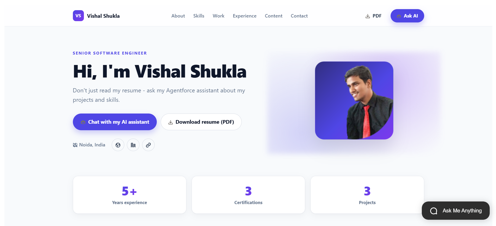

# Vishal Shukla — Personal Portfolio + Agentforce Agent

This repository holds the source code for my personal Salesforce portfolio — a public Experience Cloud (LWR) site paired with an embedded Agentforce agent that answers visitor questions about me.

The site and the agent work together:

- **Portfolio site** — a rich hero + content grid (`portfolioHome` LWC) that any visitor can browse, with resume download and featured project cards.
- **Personal Portfolio Agent** — a public-facing Agentforce service agent embedded on the site that answers questions about my bio, resume, skills, and projects, and captures connection requests as Leads.

All content shown on the site and surfaced by the agent is grounded in a single custom object — `Portfolio_Item__c`. Adding or updating records updates both the site and the agent automatically, with no prompt templates or external calls to maintain.

---

## Live site

🔗 **[vishalshukla-dev-ed.develop.my.site.com/portfolio](https://vishalshukla-dev-ed.develop.my.site.com/portfolio/)**

The hero, content grid, and resume download are driven by `Portfolio_Item__c` records. The **Personal Portfolio Agent** is accessible via the **Ask AI** / **Chat with my AI assistant** button in the chat panel.

---

## What’s in the box

| Area                | Metadata                                                                                                                                                            |
| ------------------- | ------------------------------------------------------------------------------------------------------------------------------------------------------------------- |
| **Data model**      | `Portfolio_Item__c` custom object (13 fields), tab, layout, `All_Items` list view                                                                                   |
| **Portfolio site**  | Digital Experience (LWR) site bundle `Vishal_Shukla_Portfolio1` (label `My_Portfolio`), `portfolioHome` LWC, `portfolioBridge` static resource, 6 CSP Trusted Sites |
| **Admin tools**     | `Portfolio_Manager` app, `portfolioOnboarding` LWC ("Portfolio Setup (AI)"), `portfolioItemAssistant` LWC ("Portfolio Item AI Assistant")                           |
| **Agent**           | `Personal_Portfolio_Agent` (Agent Script bundle + Bot + version `v14` + planner bundles), `Portfolio_Agent` Messaging Channel + Embedded Service deployment         |
| **Apex**            | 8 classes (+ tests): public/PDF controllers and the agent’s invocable actions                                                                                       |
| **Messaging queue** | `Portfolio_Queue` + `Messaging` queue routing config                                                                                                                |
| **Security**        | 5 permission sets (owner, manager, guest, agent, agent-guest)                                                                                                       |

**Apex classes at a glance**

- `PortfolioPublicController` — read-only data for the public `portfolioHome` grid.
- `PortfolioPdfController` — generates the downloadable resume/portfolio PDF in Apex (no Visualforce).
- `PortfolioOnboardingService` — turns a pasted resume into draft records (Models API). Powers onboarding.
- `PortfolioContentAssistant` — generates/improves descriptions & resume text on a record (Models API).
- `PortfolioItemProvider`, `PortfolioOverviewProvider`, `ResumeDetailsProvider`, `ConnectionRequestCreator` — the agent’s invocable actions.
